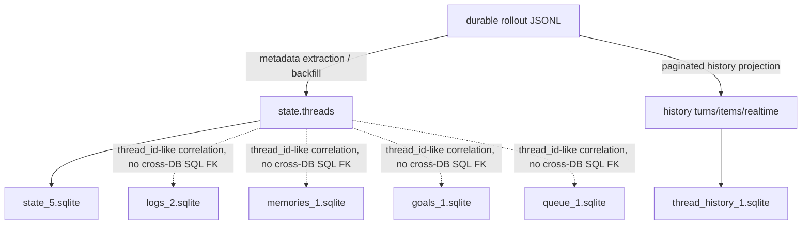

# Codex upstream SQLite schema reference

> **Status: source-derived reference, not TajsTokens architecture authority.**
>
> [`PROJECT.md`](../../PROJECT.md) remains the sole authority for TajsTokens product/data architecture during the foundation reset. This document records implementation evidence from a pinned upstream Codex source snapshot so that agents and reviewers do not have to rediscover the physical schema from scratch.
>
> **Evidence snapshot:** `openai/codex` commit `1bc8fb16ae53512c0c7723a436e4b11be81ad4a8`.
>
> The installed Codex runtime wins if it disagrees with this reference. A filename, table, column, migration, or upstream implementation detail is not permission to pretend that every local Codex Desktop build exposes the same source or lifecycle.

## Purpose and evidence labels

This reference answers a deliberately narrow question: **what SQLite stores and structures does the pinned public Codex source define, and what does the same source explicitly say about their role?**

It uses three evidence labels:

- **DDL** — established directly by Codex migrations or SQLite configuration.
- **Runtime-supported** — the pinned Codex implementation or tests explicitly read, write, join, project, or describe the structure in a way that supports more than its suggestive name.
- **TajsTokens handling note** — a local product/privacy consequence for inspection. This is not a claim that Codex itself assigns that classification.

Anything not supported at one of those levels stays unknown. This document is intentionally a reference map rather than another architecture specification.

## Runtime database set

At the pinned snapshot, `codex-rs/state/src/sqlite.rs` defines six SQLite databases managed by the Codex state runtime:

| Runtime kind | Filename | Migration set | Upstream role that is explicit in code |
| --- | --- | --- | --- |
| State | `state_5.sqlite` | `codex-rs/state/migrations` | Primary state database |
| Logs | `logs_2.sqlite` | `codex-rs/state/logs_migrations` | Log database |
| Goals | `goals_1.sqlite` | `codex-rs/state/goals_migrations` | Goals database |
| Memories | `memories_1.sqlite` | `codex-rs/state/memory_migrations` | Memories database |
| Queue | `queue_1.sqlite` | `codex-rs/state/queue_migrations` | Durable user-message queue database |
| Thread history | `thread_history_1.sqlite` | `codex-rs/state/thread_history_migrations` | Paginated thread-history database |

These filenames are **current upstream implementation constants**, not semantic version contracts for TajsTokens. `SqliteConfig::runtime_db_paths()` treats the six as separate runtime stores, and `migrations.rs` assigns each an independent SQLx migrator.

Codex opens writable runtime stores in WAL mode with `synchronous=NORMAL`, incremental auto-vacuum, a five-second busy timeout, and up to five pooled connections. Its dedicated read-only path uses `read_only=true`, does not create missing files, and uses a single connection. TajsTokens still applies its own stricter read-only acquisition policy when inspecting Codex-owned files.

The runtime migrators use `ignore_missing=true` so an older Codex binary can open a database already migrated by a newer concurrent binary. Known migrations are still checksum-validated. Therefore, **database-ahead-of-binary states are deliberately supported upstream**, another reason not to infer capabilities only from a filename.

## High-level relationship map



The solid arrows above are supported by upstream implementation. The dotted edges deliberately say less: separate SQLite files cannot enforce ordinary SQLite foreign keys across one another, even where they carry a field named `thread_id`. Product joins still need the relevant source contract/runtime evidence.

---

# `state_5.sqlite`

## Current table inventory

Reconstructing migrations `0001` through `0052` at the pinned commit gives these current application tables, excluding SQLx's `_sqlx_migrations` bookkeeping table:

| Table | Evidence | What the upstream source safely establishes |
| --- | --- | --- |
| `threads` | DDL + Runtime-supported | Canonical persisted thread metadata used by Codex state runtime |
| `thread_dynamic_tools` | DDL + Runtime-supported | Ordered dynamic-tool definitions associated with a thread |
| `backfill_state` | DDL + Runtime-supported | Singleton progress/checkpoint state for rollout-to-state backfill |
| `thread_spawn_edges` | DDL + Runtime-supported | Directional parent/child spawned-thread edges with native edge status |
| `remote_control_enrollments` | DDL | Persisted remote-control enrollment records |
| `external_agent_config_imports` | DDL | Results/metadata for external agent-config imports |
| `thread_sections` | DDL + Runtime-supported | Independently persisted user-facing thread sections and appearance metadata |
| `rollout_migration_state` | DDL | Checkpoint state for named rollout migrations |
| `rollout_migration_skipped_rollouts` | DDL | Rollouts skipped by a named rollout migration, including reason and file metadata |
| `projects` | DDL + Runtime-supported | Persisted projects with ordering and metadata |
| `project_roots` | DDL + Runtime-supported | Ordered filesystem roots owned by a project |
| `project_idempotency_keys` | DDL + Runtime-supported | Idempotency-key-to-project mapping used by project creation |
| `thread_artifacts` | DDL | Thread-associated typed artifact payload records |

Older migrations also created structures that are **not part of the current state DB schema** at this snapshot. See [Tables moved or removed from state](#tables-moved-or-removed-from-state).

## `threads`

`threads` is the center of the upstream state model. The current physical shape is the original table plus later additive migrations.

### Current columns

| Column | SQLite shape | Upstream evidence / caution |
| --- | --- | --- |
| `id` | `TEXT PRIMARY KEY` | `ThreadMetadata.id`; runtime queries use it as the thread identifier |
| `rollout_path` | `TEXT NOT NULL` | Absolute rollout path in `ThreadMetadata`; physical path can change while logical thread ID remains stable |
| `created_at` | `INTEGER NOT NULL` | Legacy timestamp representation retained in schema |
| `updated_at` | `INTEGER NOT NULL` | Legacy timestamp representation retained in schema |
| `source` | `TEXT NOT NULL` | Session source, stored as a stringified enum |
| `model_provider` | `TEXT NOT NULL` | Model-provider identifier |
| `cwd` | `TEXT NOT NULL` | Thread working directory |
| `title` | `TEXT NOT NULL` | Best-effort title; not interchangeable with `name` for every history mode |
| `sandbox_policy` | `TEXT NOT NULL` | Stringified sandbox policy |
| `approval_mode` | `TEXT NOT NULL` | Stringified approval mode |
| `tokens_used` | `INTEGER NOT NULL DEFAULT 0` | Upstream `ThreadMetadata` calls this the last observed token usage; do not reinterpret it as an account total |
| `has_user_event` | `INTEGER NOT NULL DEFAULT 0` | Legacy/indexing-era field still physically present |
| `archived` | `INTEGER NOT NULL DEFAULT 0` | Used by state-runtime filters and indexes |
| `archived_at` | `INTEGER` | Archive timestamp when present |
| `git_sha` | `TEXT` | Git commit SHA when known |
| `git_branch` | `TEXT` | Git branch when known |
| `git_origin_url` | `TEXT` | Sanitized Git origin URL when known |
| `cli_version` | `TEXT NOT NULL DEFAULT ''` | CLI version that created the thread |
| `first_user_message` | `TEXT NOT NULL DEFAULT ''` | First user message observed for the thread; content-bearing |
| `agent_nickname` | `TEXT` | Optional nickname for an AgentControl-spawned sub-agent |
| `agent_role` | `TEXT` | Optional role for an AgentControl-spawned sub-agent |
| `memory_mode` | `TEXT NOT NULL DEFAULT 'enabled'` | Persisted thread memory mode; runtime has explicit get/set operations |
| `model` | `TEXT` | Latest observed model |
| `reasoning_effort` | `TEXT` | Latest observed reasoning effort |
| `agent_path` | `TEXT` | Optional canonical agent path for an AgentControl-spawned sub-agent |
| `created_at_ms` | `INTEGER` | Millisecond timestamp added/backfilled by migration 0025 |
| `updated_at_ms` | `INTEGER` | Millisecond timestamp added/backfilled by migration 0025 |
| `thread_source` | `TEXT` | Optional analytics source classification |
| `preview` | `TEXT NOT NULL DEFAULT ''` | Best available user-facing discovery/list preview; content-bearing |
| `recency_at` | `INTEGER NOT NULL DEFAULT 0` | Legacy product-recency representation |
| `recency_at_ms` | `INTEGER NOT NULL DEFAULT 0` | Product recency timestamp used by current state sorting/indexes |
| `history_mode` | `TEXT NOT NULL DEFAULT 'legacy'` | Persisted thread-history contract |
| `name` | `TEXT` | Explicit user-facing thread name when one is set |
| `is_pinned` | `INTEGER NOT NULL DEFAULT 0` | Pin flag retained alongside the newer section model |
| `thread_section_id` | `TEXT` FK -> `thread_sections(id)` | User-selected section, `ON DELETE SET NULL` |
| `section_position` | `INTEGER` | Stable sparse ordering rank within a section |
| `section_entered_at_ms` | `INTEGER` | Time the thread most recently entered its current section |
| `project_id` | `TEXT` FK -> `projects(id)` | Canonical project assignment, `ON DELETE SET NULL` |

### Semantics explicitly supported by runtime code

`codex-rs/state/src/model/thread_metadata.rs` calls `ThreadMetadata` the **canonical persisted thread metadata** and documents many of the fields above directly. `codex-rs/state/src/runtime/threads.rs` reads the current fields into that model rather than treating `threads` as an arbitrary cache blob.

Several details matter to TajsTokens:

- `created_at`, `updated_at`, and `recency_at` are distinct concepts in the runtime model. `recency_at` is explicitly the product recency timestamp, not a synonym TajsTokens should silently replace with `updated_at`.
- `history_mode` changes display behavior. Upstream code notes that legacy threads display `title` with a fallback, whereas paginated threads display `name`; `title` remains derived metadata used for search. A generic `display_name = title ?? name` rule would therefore be made-up behavior.
- For paginated threads, some metadata updates are SQLite-owned. The metadata reconciliation code deliberately preserves the current SQLite Git tuple rather than restoring stale rollout values.
- `rollout_path` is physical location, not logical identity. `replace_rollout_path_if_current` can swap the path while keeping metadata attached to the same thread ID.
- `first_user_message`, `preview`, and potentially `title`/`name` can contain user-facing content. **TajsTokens handling note:** local inspection is fine under `PROJECT.md`; durable duplication/export needs its own retention/privacy decision.

## `thread_dynamic_tools`

Current columns:

| Column | Shape |
| --- | --- |
| `thread_id` | `TEXT NOT NULL`, FK -> `threads(id)` `ON DELETE CASCADE` |
| `position` | `INTEGER NOT NULL` |
| `name` | `TEXT NOT NULL` |
| `description` | `TEXT NOT NULL` |
| `input_schema` | `TEXT NOT NULL` |
| `defer_loading` | `INTEGER NOT NULL DEFAULT 0` |
| `namespace` | `TEXT` |

Primary key: `(thread_id, position)`.

The thread-store type describes these as dynamic tools available to the thread at startup. The schema preserves source-native ordering, description, input schema, deferred-loading flag, and namespace rather than collapsing the tools into a generic boolean capability list.

**TajsTokens handling note:** `input_schema` and descriptions can be large or descriptive. Their presence is useful for local observability but is not by itself a reason to duplicate them durably.

## `thread_spawn_edges`

```text
parent_thread_id TEXT NOT NULL
child_thread_id  TEXT NOT NULL PRIMARY KEY
status           TEXT NOT NULL
```

Index: `(parent_thread_id, status)`.

This is stronger than a suggestive schema name. The state runtime explicitly calls these **directional parent-child edges**, joins `child_thread_id` to `threads.id`, lists direct children, recursively traverses descendants, and looks up descendants by canonical `agent_path`.

The native status enum at the pinned commit has exactly two values serialized in snake case:

- `open`
- `closed`

There is no SQL foreign-key declaration on the edge table itself. The relationship is nevertheless explicit in runtime code. TajsTokens should preserve that distinction: **runtime-supported relationship, not schema-enforced referential integrity**.

Because `child_thread_id` is the primary key, the physical schema permits at most one stored incoming spawn edge per child row.

## `thread_sections`

Current columns:

```text
id         TEXT PRIMARY KEY
name       TEXT NOT NULL
appearance TEXT
```

Migration 0045 seeds a `Pinned` section and adds `threads.thread_section_id`. Migration 0046 adds per-thread section ordering and entry time. Migration 0048 adds `appearance`.

The runtime model describes a section as independently persisted and user-facing. `appearance` is parsed as optional JSON containing optional `icon` and `color` fields. Section IDs are opaque identifiers; the runtime documentation describes them as UUIDv7.

An older `threads.is_pinned` field and the newer section mechanism both exist in the current schema. Their coexistence is a source fact. TajsTokens should not invent a precedence rule merely because humans apparently cannot resist representing pinning twice.

## Projects

### `projects`

```text
id            TEXT PRIMARY KEY
name          TEXT NOT NULL
metadata      TEXT NOT NULL DEFAULT '{}'
position      INTEGER NOT NULL
created_at_ms INTEGER NOT NULL
updated_at_ms INTEGER NOT NULL
```

### `project_roots`

```text
project_id TEXT NOT NULL REFERENCES projects(id) ON DELETE CASCADE
position   INTEGER NOT NULL
path       TEXT NOT NULL
PRIMARY KEY (project_id, position)
```

### `project_idempotency_keys`

```text
key           TEXT PRIMARY KEY
project_id    TEXT NOT NULL
created_at_ms INTEGER NOT NULL
```

`threads.project_id` references `projects(id)` with `ON DELETE SET NULL`.

Runtime support is unusually explicit here:

- project creation uses UUIDv7 IDs;
- roots are hydrated in `position` order;
- thread assignment writes `threads.project_id` after verifying the project exists;
- project list/read models compute member recency as `MAX(threads.recency_at_ms)` among non-archived assigned threads;
- deletion unassigns matching threads before deleting the project;
- `project_idempotency_keys` is actively consulted during create and an orphaned mapping is treated as an error.

Notice that `project_idempotency_keys.project_id` is **not declared as a SQL foreign key** even though runtime code treats it as a project reference. Again, implementation semantics and physical integrity constraints are related but not identical evidence.

## `thread_artifacts`

```text
id            TEXT PRIMARY KEY
thread_id     TEXT NOT NULL REFERENCES threads(id) ON DELETE CASCADE
artifact_type TEXT NOT NULL
identity_key  TEXT NOT NULL
payload       TEXT NOT NULL
created_at    INTEGER NOT NULL
UNIQUE (thread_id, artifact_type, identity_key)
```

The DDL proves thread ownership, typed identity, uniqueness, payload storage, and creation ordering. This reference does **not** assign product meaning to particular `artifact_type` or payload variants without additional runtime evidence.

**TajsTokens handling note:** `payload` is potentially content-bearing. Treat it accordingly until a narrower contract proves otherwise.

## Backfill and rollout-migration bookkeeping

### `backfill_state`

Singleton row enforced by `CHECK (id = 1)`:

```text
id              INTEGER PRIMARY KEY
status          TEXT NOT NULL
last_watermark  TEXT
last_success_at INTEGER
updated_at      INTEGER NOT NULL
```

It is initialized as `pending`. Upstream rollout metadata code uses this state while scanning rollout files and upserting extracted thread metadata into the state DB.

### `rollout_migration_state`

```text
migration_id                    TEXT PRIMARY KEY
last_checked_thread_created_at INTEGER
last_checked_thread_id         TEXT
updated_at                      INTEGER NOT NULL
```

### `rollout_migration_skipped_rollouts`

```text
migration_id          TEXT NOT NULL
rollout_path          TEXT NOT NULL
rollout_size_bytes    INTEGER NOT NULL
rollout_modified_at_ns INTEGER NOT NULL
skip_reason           TEXT NOT NULL
skipped_at            INTEGER NOT NULL
PRIMARY KEY (migration_id, rollout_path)
```

These are migration/checkpoint mechanics. Their timestamps and watermarks should not be repackaged as thread activity merely because they happen to mention threads or rollout files.

## Remote-control and external-import state

### `remote_control_enrollments`

```text
websocket_url          TEXT NOT NULL
account_id             TEXT NOT NULL
app_server_client_name TEXT NOT NULL
server_id              TEXT NOT NULL
environment_id         TEXT NOT NULL
server_name            TEXT NOT NULL
updated_at             INTEGER NOT NULL
remote_control_enabled INTEGER
PRIMARY KEY (websocket_url, account_id, app_server_client_name)
```

**TajsTokens handling note:** this is identity/network/environment metadata. Local diagnostics may legitimately inspect it, but exports should not casually ship account IDs, endpoints, environment IDs, or server names into bug reports.

### `external_agent_config_imports`

```text
import_id       TEXT PRIMARY KEY
completed_at_ms INTEGER NOT NULL
successes       TEXT NOT NULL
failures        TEXT NOT NULL
provider_id     TEXT
```

The DDL establishes storage shape only here. `successes` and `failures` are opaque `TEXT` at the schema level; this document does not guess their payload contract.

---

# `thread_history_1.sqlite`

This database has one of the strongest upstream contracts because migrations, projector implementation, read APIs, and tests all describe how it is produced.

## Projection model

Upstream implementation treats thread-history SQLite as a **materialized projection of durable rollout JSONL** for paginated history.

A projected rollout line carries:

- an ordinal;
- absolute start and end byte offsets in durable JSONL;
- a fallback timestamp;
- a thread-history change set;
- optionally a realtime item.

The projector writes projected rows and advances `thread_history_projection_state` in the **same SQLite transaction**. The source comment is explicit about the invariant: if SQLite projection fails, the database stays behind the durable rollout instead of claiming a prefix it did not materialize.

This makes the relationship important:

```text
rollout JSONL = durable replay/source history
        |
        v
thread-history projector
        |
        +--> thread_turns
        +--> thread_items
        +--> thread_realtime_items
        +--> thread_history_projection_state
```

That does not mean TajsTokens should blindly persist both copies. It means the SQLite history tables can be understood as Codex-owned materialized structures rather than mysterious unrelated telemetry.

## `thread_turns`

Current columns:

```text
thread_id               TEXT NOT NULL
turn_id                 TEXT NOT NULL
rollout_ordinal         INTEGER NOT NULL
status                  TEXT NOT NULL
error_json              TEXT
started_at              INTEGER
completed_at            INTEGER
duration_ms             INTEGER
first_user_item_id      TEXT
final_agent_item_id     TEXT
rollout_byte_offset     INTEGER
rollout_end_ordinal     INTEGER
rollout_end_byte_offset INTEGER
PRIMARY KEY (thread_id, turn_id)
```

The projector supports source-native states corresponding to:

- `inProgress`
- `completed`
- `interrupted`
- `failed`

For a turn that appears again as its lifecycle advances, the implementation updates status/error/timestamps and terminal rollout position **while keeping the rollout ordinal from the first record that created the turn**. Terminal statuses receive `rollout_end_ordinal` and `rollout_end_byte_offset`; an in-progress turn does not.

The projector also fills `first_user_item_id` and `final_agent_item_id` from projected item rows when possible. Upstream logic explicitly handles review turns where completed items can exist before the turn lifecycle record.

## `thread_items`

Current columns:

```text
thread_id          TEXT NOT NULL
turn_id            TEXT NOT NULL
item_id            TEXT NOT NULL
rollout_ordinal    INTEGER NOT NULL
created_at_ms      INTEGER NOT NULL
item_json          TEXT NOT NULL
item_type          TEXT NOT NULL DEFAULT ''
updated_at_ordinal INTEGER NOT NULL DEFAULT 0
PRIMARY KEY (thread_id, turn_id, item_id)
```

Important runtime-supported details:

- `item_type` is extracted from `item_json.$.type` and separately indexed for some reads.
- `rollout_ordinal` is the original projected position.
- `updated_at_ordinal` was introduced to represent the latest projection update position independently from creation position.
- Upstream comments describe completed items as immutable under normal local producers: an `ItemCompleted` is expected once per item. Duplicate completion is tolerated defensively and updates the snapshot while preserving original creation ordinal/timestamp.

**TajsTokens handling note:** `item_json` is explicitly content-bearing structured payload. It is highly useful for local inspection and highly unsuitable for accidental wholesale export or unexamined durable duplication.

## `thread_realtime_items`

```text
thread_id       TEXT NOT NULL
item_id         TEXT NOT NULL
rollout_ordinal INTEGER NOT NULL
created_at_ms   INTEGER NOT NULL
item_type       TEXT NOT NULL
item_json       TEXT NOT NULL
PRIMARY KEY (thread_id, item_id)
```

The table has a unique page index on `(thread_id, rollout_ordinal)` and a partial boundary index for:

- `realtime_session_started`
- `realtime_session_closed`

This is **not** generic temporary/in-progress staging. The timeline reader deliberately merges four ordered entry kinds:

```text
0 turn started
1 normal thread item
2 realtime item
3 turn completed
```

It also searches realtime start/close boundary items to reconstruct whether a realtime session was active at the beginning of a timeline page.

A trigger removes a thread's realtime rows when its projection-state row is deleted.

## `thread_history_projection_state`

```text
thread_id                TEXT PRIMARY KEY
next_rollout_byte_offset INTEGER NOT NULL
next_rollout_ordinal     INTEGER NOT NULL
```

The two checkpoint values describe the same durable rollout prefix. Projector code rejects an unexpected start offset and advances both only after ordered projection steps have been applied successfully.

There are no SQL foreign keys from thread-history tables into `state_5.sqlite`; they live in a different database. Their relationship is supported by Codex's thread-store implementation rather than by cross-file SQLite constraints.

---

# `logs_2.sqlite`

Current `logs` shape after the `0002_logs_feedback_log_body` migration:

```text
id                INTEGER PRIMARY KEY AUTOINCREMENT
ts                INTEGER NOT NULL
ts_nanos          INTEGER NOT NULL
level             TEXT NOT NULL
target            TEXT NOT NULL
feedback_log_body TEXT
module_path       TEXT
file              TEXT
line              INTEGER
thread_id         TEXT
process_uuid      TEXT
estimated_bytes   INTEGER NOT NULL DEFAULT 0
```

Indexes support:

- descending timestamp reads;
- lookup by `thread_id`;
- thread-specific time ordering;
- process-specific time ordering for rows where `thread_id IS NULL`.

Migration 0002 renamed the earlier `message` payload into `feedback_log_body` while copying existing rows into the replacement table.

**TajsTokens handling note:** `feedback_log_body`, paths, module/file metadata, thread IDs, and process IDs can expose content or operational context. Treat them as local diagnostic evidence first.

---

# `memories_1.sqlite`

## `stage1_outputs`

```text
thread_id                             TEXT PRIMARY KEY
source_updated_at                     INTEGER NOT NULL
raw_memory                            TEXT NOT NULL
rollout_summary                       TEXT NOT NULL
rollout_slug                          TEXT
generated_at                          INTEGER NOT NULL
usage_count                           INTEGER
last_usage                            INTEGER
selected_for_phase2                   INTEGER NOT NULL DEFAULT 0
selected_for_phase2_source_updated_at INTEGER
```

Index: `(source_updated_at DESC, thread_id DESC)`.

The schema itself clearly stores memory and rollout-summary payloads keyed by thread ID, but this reference does not infer every memory lifecycle from those names alone.

**TajsTokens handling note:** `raw_memory` and `rollout_summary` are overtly content-bearing. They may be valuable for a future local memory-observability view while still being poor candidates for automatic duplication/export.

## `jobs`

```text
kind                   TEXT NOT NULL
job_key                TEXT NOT NULL
status                 TEXT NOT NULL
worker_id              TEXT
ownership_token        TEXT
started_at             INTEGER
finished_at            INTEGER
lease_until            INTEGER
retry_at               INTEGER
retry_remaining        INTEGER NOT NULL
last_error             TEXT
input_watermark        INTEGER
last_success_watermark INTEGER
PRIMARY KEY (kind, job_key)
```

The schema exposes worker/lease/retry/checkpoint machinery. Status meanings and job-kind semantics should come from the relevant runtime code before becoming friendly TajsTokens labels.

---

# `goals_1.sqlite`

## `thread_goals`

```text
thread_id         TEXT PRIMARY KEY NOT NULL
goal_id           TEXT NOT NULL
objective         TEXT NOT NULL
status            TEXT NOT NULL
token_budget      INTEGER
tokens_used       INTEGER NOT NULL DEFAULT 0
time_used_seconds INTEGER NOT NULL DEFAULT 0
created_at_ms     INTEGER NOT NULL
updated_at_ms     INTEGER NOT NULL
```

The DDL constrains `status` to exactly:

```text
active
paused
blocked
usage_limited
budget_limited
complete
```

These are therefore source-native values, not a TajsTokens classification.

**TajsTokens handling note:** `objective` is content-bearing. `token_budget`, `tokens_used`, and `time_used_seconds` belong to this goal source's contract; they must not be silently merged with account quota, rollout token accounting, or other token concepts merely because the units sound familiar.

## `thread_goal_continuation_deferrals`

```text
thread_id TEXT PRIMARY KEY NOT NULL
          REFERENCES thread_goals(thread_id) ON DELETE CASCADE
```

The DDL establishes membership/ownership relative to `thread_goals`. A richer explanation of what constitutes a continuation deferral should come from the goals runtime, not from inventing prose around the table name.

---

# `queue_1.sqlite`

`SqliteConfig` explicitly calls this the **durable user-message queue database**.

## `queued_items`

```text
id            TEXT PRIMARY KEY NOT NULL
thread_id     TEXT NOT NULL
payload_json  TEXT NOT NULL
queue_order   INTEGER NOT NULL
created_at_ms INTEGER NOT NULL
updated_at_ms INTEGER NOT NULL
```

Unique index: `(thread_id, queue_order)`.

**TajsTokens handling note:** `payload_json` is potentially content-bearing and remains source-native opaque JSON until its payload variants are contracted.

## `queued_thread_revisions`

```text
revision  INTEGER PRIMARY KEY AUTOINCREMENT
thread_id TEXT NOT NULL UNIQUE
```

Triggers fire after insert, update, and delete on `queued_items`. They upsert the affected thread and assign a new revision using the next value above the current maximum. This gives the queue a thread-scoped change/revision signal without TajsTokens having to fabricate one from timestamps.

A revision proves that the queue representation for that thread changed according to Codex's trigger policy. It does **not** by itself say what product event occurred.

---

# Rollout JSONL and SQLite

Rollout JSONL is not another SQLite table, but omitting it from a schema reference would leave the most important relationship looking like wizardry.

`codex-rs/rollout/src/metadata.rs` and the thread-store implementation establish several useful facts:

- state metadata can be extracted/backfilled from rollout files;
- normal rollout filenames use a thread ID as both thread and rollout identity;
- after `thread/revert`, the logical thread ID can stay stable while Codex switches to a new immutable rollout file with a distinct rollout ID;
- therefore `thread_id`, `rollout_id`, and `rollout_path` are **not universally interchangeable identities**;
- paginated thread history materializes ordered rollout content into `thread_history_1.sqlite`;
- history inheritance/forking can refer to a bounded rollout prefix rather than requiring a copied flat history.

For TajsTokens this suggests a very useful diagnostic principle without dictating the eventual durable schema:

```text
logical thread identity
    != physical rollout path
    != rollout-file identity in every lifecycle state
```

That distinction is already upstream behavior, not a hypothetical edge case invented for architectural purity.

---

# Tables moved or removed from state

Reading only early `state_5.sqlite` migrations would produce a hilariously incorrect "current schema" because Codex has split responsibilities into dedicated databases over time.

At the pinned snapshot:

| Earlier state table(s) | Current status in state migration history |
| --- | --- |
| `logs` | dropped by state migration 0023; logs have their own `logs_2.sqlite` migrator |
| `device_key_bindings` | dropped by migration 0031 |
| `thread_goals` | dropped by migration 0034; goals have their own `goals_1.sqlite` migrator |
| `jobs`, `stage1_outputs` | dropped by migration 0035; memories have their own `memories_1.sqlite` migrator |
| `agent_jobs`, `agent_job_items` | dropped by migration 0042 |

Consequently, a historical snapshot, an older local installation, and the current upstream migration target can all legitimately expose different object sets. TajsTokens' schema fingerprinting is the correct acquisition behavior: **inspect actual capabilities, do not turn `state_5.sqlite` into a magical schema promise.**

# Sources not covered by this reference

This file maps the public Rust state runtime's six SQLite stores and their relationship to rollout JSONL. It is **not a declaration that these are every database Codex Desktop can own**.

The installed application can expose additional Desktop/app-local stores. If TajsTokens observes a catalog/app database or another source whose implementation is absent from public `openai/codex`, that source remains valid runtime evidence. Its contract must be based on local observation and whatever matching implementation evidence is actually available.

Likewise, app-server protocol surfaces are not SQLite and are outside this file's physical-schema scope.

# What this reference establishes

Safe conclusions from the pinned upstream source include:

- Codex intentionally splits runtime state across six independently migrated SQLite databases.
- `state_5.sqlite` contains rich canonical persisted thread metadata plus project, section, spawn, dynamic-tool, artifact, migration, remote-control, and import structures.
- project/root assignment and spawned-thread topology have explicit runtime semantics beyond their names.
- paginated thread-history SQLite is a transactional materialized projection of durable rollout JSONL.
- normal items and realtime items are distinct source-native history lanes.
- logs, memories, goals, and queue state are intentionally separate stores, not tables that TajsTokens should expect inside current state DB.
- several payload-bearing fields are locally inspectable but require separate TajsTokens retention/export decisions.

This reference does **not** establish:

- that the user's installed Codex build has byte-for-byte identical schema;
- that every same-looking `thread_id` in every store has identical lifecycle/coverage guarantees;
- source precedence when two stores appear to describe the same fact;
- a universal TajsTokens provider schema;
- permission to durably copy content-bearing JSON/text;
- user-facing meaning for opaque payloads, statuses, or table names not corroborated by runtime code.

# Upstream source pointers

Pinned commit: `1bc8fb16ae53512c0c7723a436e4b11be81ad4a8`

Primary files used for this reference:

```text
codex-rs/state/src/sqlite.rs
codex-rs/state/src/migrations.rs
codex-rs/state/src/model/thread_metadata.rs
codex-rs/state/src/model/graph.rs
codex-rs/state/src/runtime/threads.rs
codex-rs/state/src/runtime/projects.rs
codex-rs/state/migrations/*.sql
codex-rs/state/thread_history_migrations/*.sql
codex-rs/state/logs_migrations/*.sql
codex-rs/state/memory_migrations/*.sql
codex-rs/state/goals_migrations/*.sql
codex-rs/state/queue_migrations/*.sql
codex-rs/thread-store/src/local/thread_history.rs
codex-rs/thread-store/src/local/thread_history/realtime.rs
codex-rs/thread-store/src/types.rs
codex-rs/rollout/src/metadata.rs
```

The local read-only reference checkout documented in `AGENTS.md` can be used to inspect the same paths at a matching commit. When updating this document, pin the new upstream commit and separate schema changes from newly inferred semantics rather than casually editing the reference to whatever `main` happens to contain that afternoon.
